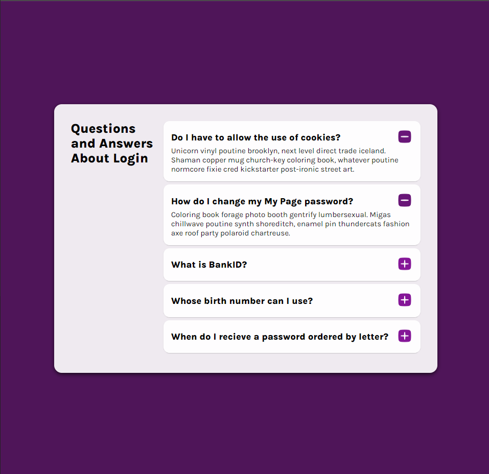

# Travel Journal

### React App

FAQ, short for frequently asked questions, is a list of commonly asked questions and answers about a specific topic. FAQ is most often read as separate letters, but is also pronounced as “fak” in rare instances.

### App Components

1. UI Design Daily (Link)
2. Generative Card
3. Pure Css
3. useState Hoke 

### Web Page

